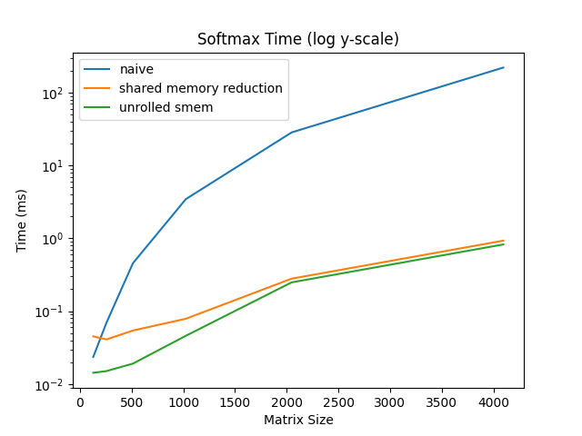

## High Performance NNs
im was learning GPU computing by optimizing neural network kernels

##### Setup
```sh
conda install cuda -c nvidia/label/cuda-12.6.3
make all
# run ./nn.o or ./mm.o ./activation.o
# modify hyperparameters through macros in their respective files
```

### Matrix Multiplication

| | |
|:-------------------------:|:-------------------------:|
| Higher is better |   Lower is better |

```sh
$ ./mm.o
Matrix A: 1024 x 1024
Matrix B: 1024 x 1024
Matrix C: 1024 x 1024
Block size: 16 x 16

Naive Kernel:
Time: 13.4953 ms
Performance: 159.13 GFLOPS

1D Block Tiling Kernel:
Time: 0.8926 ms
Performance: 2405.85 GFLOPS

Validation Results:
Naive Kernel max error: 9.155273e-05
1D Block Tiling Kernel max error: 9.155273e-05
```

### Softmax Function

| | |
|:-------------------------:|:-------------------------:|
| Higher is better |   Lower is better |

```sh
$ ./activation.o
Matrix size: 1024 x 1024

Naive Softmax Kernel:
Time: 3.4529 ms
Performance: 2.4294 GLFOPS

SMEM Reduction Softmax Kernel:
Time: 0.0451 ms
Performance: 162.9091 GLFOPS

Verifying Results:
Naive Kernel max error: 5.587935e-09
SMEM reduction Kernel max error: 4.097819e-08
```

### Neural Network
  |             | Time per epoch   | Performance (%) | Performance (x)|
  | :---:          |  :---:           | :---:| :---:|
  | **Naive NN**      |  239 ms          |100%|1.00x|
  | **Optimized NN**  |  123 ms          |100 + 48.53%|1.94x|


#### Naive NN implementation

```sh
$ ./nn.o
Hyperparameters:
Hidden Layer 1: 256
Hidden Layer 2: 256
Output Layer: 10
Batch Size: 256
Learning Rate: 0.015000
Epochs: 10

read mnist took 2381 ms
initialization took 1860 ms
epoch 0 269ms | loss 5963.16 | acc 0.494525 | val loss 534.968 | val acc 0.768429
epoch 1 238ms | loss 2455.19 | acc 0.809145 | val loss 348.982 | val acc 0.847155
epoch 2 238ms | loss 1856.23 | acc 0.851179 | val loss 300.288 | val acc 0.86899
epoch 3 239ms | loss 1630.9 | acc 0.870593 | val loss 278.598 | val acc 0.88151
epoch 4 238ms | loss 1515.37 | acc 0.880809 | val loss 265.987 | val acc 0.888522
epoch 5 239ms | loss 1439.92 | acc 0.886301 | val loss 256.641 | val acc 0.89353
epoch 6 239ms | loss 1385.83 | acc 0.891026 | val loss 249.132 | val acc 0.898438
epoch 7 239ms | loss 1344.56 | acc 0.895065 | val loss 243.329 | val acc 0.901142
epoch 8 239ms | loss 1309.36 | acc 0.898237 | val loss 238.113 | val acc 0.903446
epoch 9 239ms | loss 1278.04 | acc 0.901159 | val loss 233.016 | val acc 0.90615
finished training, total time = 2417 ms
```

#### Optimized NN implementation

```sh
Hyperparameters:
Hidden Layer 1: 256
Hidden Layer 2: 256
Output Layer: 10
Batch Size: 256
Learning Rate: 0.015000
Epochs: 10

read mnist took 1454 ms
initialization took 113 ms
epoch 0 144ms | loss 5960.6 | acc 0.49379 | val loss 531.156 | val acc 0.766627
epoch 1 124ms | loss 2440.52 | acc 0.810196 | val loss 347.35 | val acc 0.848057
epoch 2 123ms | loss 1854.34 | acc 0.851345 | val loss 300.709 | val acc 0.870092
epoch 3 123ms | loss 1636.67 | acc 0.870393 | val loss 277.957 | val acc 0.880208
epoch 4 123ms | loss 1517.52 | acc 0.880626 | val loss 264.129 | val acc 0.887821
epoch 5 123ms | loss 1439.88 | acc 0.886936 | val loss 255.306 | val acc 0.892929
epoch 6 123ms | loss 1385.67 | acc 0.890875 | val loss 248.474 | val acc 0.897736
epoch 7 123ms | loss 1343.11 | acc 0.895015 | val loss 242.408 | val acc 0.901342
epoch 8 123ms | loss 1307.31 | acc 0.898738 | val loss 236.967 | val acc 0.905048
epoch 9 123ms | loss 1276.57 | acc 0.901542 | val loss 231.689 | val acc 0.908153
finished training, total time = 1252 ms
```

### References

- https://siboehm.com/articles/22/CUDA-MMM
- https://www.youtube.com/playlist?list=PL5XwKDZZlwaY7t0M5OLprpkJUIrF8Lc9j


#### My device
https://github.com/NVIDIA/cuda-samples.git

```sh
cuda-samples/Samples/1_Utilities/deviceQuery git:master  
(torch241cuda121) ❯ ./deviceQuery
./deviceQuery Starting...

 CUDA Device Query (Runtime API) version (CUDART static linking)

Detected 1 CUDA Capable device(s)

Device 0: "NVIDIA GeForce RTX 4050 Laptop GPU"
  CUDA Driver Version / Runtime Version          12.7 / 12.6
  CUDA Capability Major/Minor version number:    8.9
  Total amount of global memory:                 5797 MBytes (6078595072 bytes)
  (020) Multiprocessors, (128) CUDA Cores/MP:    2560 CUDA Cores
  GPU Max Clock rate:                            2130 MHz (2.13 GHz)
  Memory Clock rate:                             8001 Mhz
  Memory Bus Width:                              96-bit
  L2 Cache Size:                                 25165824 bytes
  Maximum Texture Dimension Size (x,y,z)         1D=(131072), 2D=(131072, 65536), 3D=(16384, 16384, 16384)
  Maximum Layered 1D Texture Size, (num) layers  1D=(32768), 2048 layers
  Maximum Layered 2D Texture Size, (num) layers  2D=(32768, 32768), 2048 layers
  Total amount of constant memory:               65536 bytes
  Total amount of shared memory per block:       49152 bytes
  Total shared memory per multiprocessor:        102400 bytes
  Total number of registers available per block: 65536
  Warp size:                                     32
  Maximum number of threads per multiprocessor:  1536
  Maximum number of threads per block:           1024
  Max dimension size of a thread block (x,y,z): (1024, 1024, 64)
  Max dimension size of a grid size    (x,y,z): (2147483647, 65535, 65535)
  Maximum memory pitch:                          2147483647 bytes
  Texture alignment:                             512 bytes
  Concurrent copy and kernel execution:          Yes with 2 copy engine(s)
  Run time limit on kernels:                     No
  Integrated GPU sharing Host Memory:            No
  Support host page-locked memory mapping:       Yes
  Alignment requirement for Surfaces:            Yes
  Device has ECC support:                        Disabled
  Device supports Unified Addressing (UVA):      Yes
  Device supports Managed Memory:                Yes
  Device supports Compute Preemption:            Yes
  Supports Cooperative Kernel Launch:            Yes
  Supports MultiDevice Co-op Kernel Launch:      Yes
  Device PCI Domain ID / Bus ID / location ID:   0 / 1 / 0
  Compute Mode:
     < Default (multiple host threads can use ::cudaSetDevice() with device simultaneously) >

deviceQuery, CUDA Driver = CUDART, CUDA Driver Version = 12.7, CUDA Runtime Version = 12.6, NumDevs = 1
Result = PASS
```

